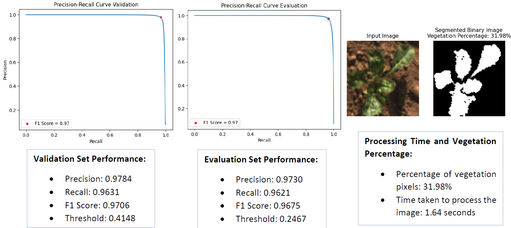
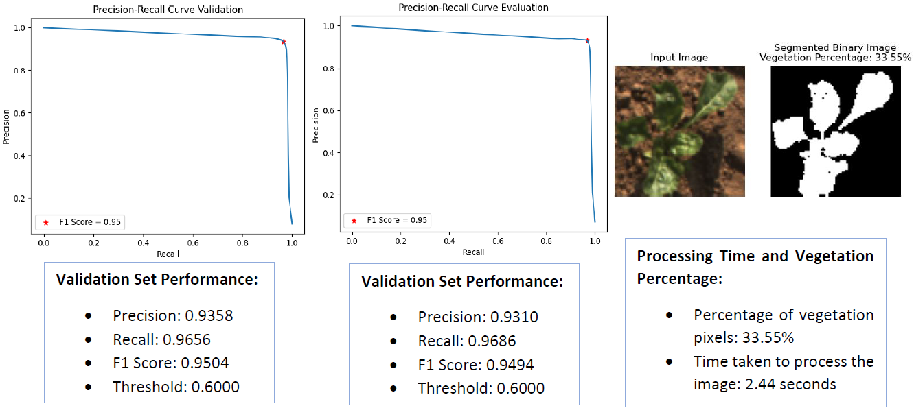
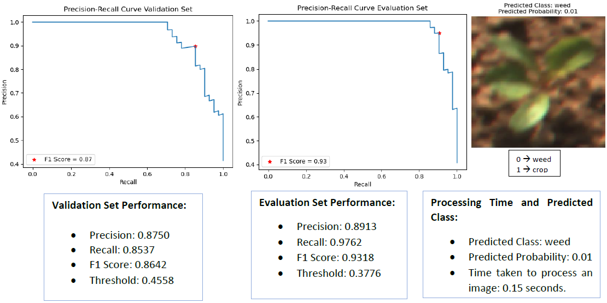
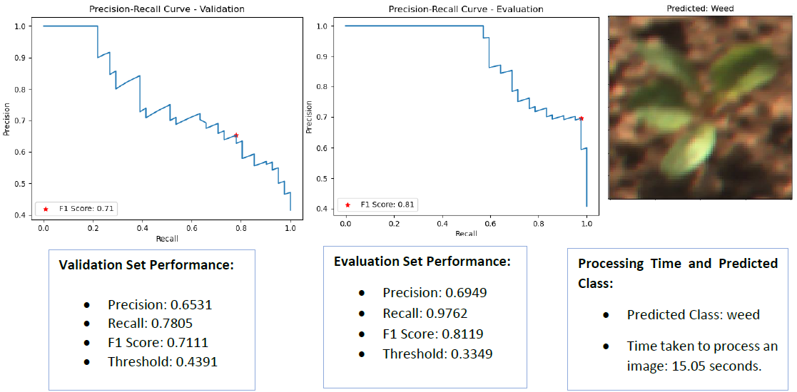

# Vegetation Segmentation and Classification

This repository contains implementations of various algorithms for vegetation segmentation and classification, developed as part of a master's course project.

## Project Structure

The repository is organized into two main parts:

### Part I: Vegetation Segmentation
- **Logistic Regression (Custom Implementation)**
- **K-Nearest Neighbor (Sklearn Implementation)**

### Part II: Vegetation Classification
- **Convolutional Neural Network (Sklearn/TensorFlow Implementation)**
- **Local Binary Pattern with Support Vector Classification (Custom Implementation)**
- **CNN Extension for Multi-class Classification (Sklearn/TensorFlow Implementation)**

## Technical Details

### Vegetation Segmentation using Logistic Regression
- Custom implementation of logistic regression for binary classification
- Uses LAB color space for better feature representation
- Gradient descent optimization with configurable learning rate and iterations
- Model can be saved and loaded using pickle
- Evaluation using precision-recall curves and F1 scores



### Vegetation Segmentation using K-Nearest Neighbors
- Implementation using sklearn's KNeighborsClassifier
- Feature normalization for improved distance calculations
- Configurable number of neighbors and distance metrics (Euclidean, Minkowski)
- Evaluation metrics similar to logistic regression implementation



### Vegetation Classification using CNN
- Binary classification of crop vs. weed using Convolutional Neural Network
- Architecture: Multiple convolutional layers with max pooling and dense layers
- Configurable hyperparameters: learning rate, epochs, batch size, optimizer
- Sigmoid activation for binary output (crop or weed), trained with binary cross-entropy loss



### Vegetation Classification Extension (Multi-class)
- Extended CNN implementation for multi-class classification
- Three classes: crop, grass, and other
- Softmax activation for multiple class probabilities
- Evaluated using confusion matrices for each class

### Vegetation Classification using LBP and SVC
- Feature extraction using custom Local Binary Pattern implementation
- Support Vector Classification for binary classification
- Configurable LBP parameters (radius, number of points)
- Adjustable SVC regularization parameter



## Usage

Each implementation includes a command-line interface with various configurable parameters:

### Segmentation Examples:
```bash
python vegetation_segmentation_solution1.py image.png  # Logistic Regression
python vegetation_segmentation_solution2.py image.png  # KNN
```

Optional arguments:
- `--imax`: Maximum iterations (Logistic Regression)
- `--lr`: Learning rate (Logistic Regression)
- `--n_neighbors`: Number of neighbors (KNN)
- `--distance`: Distance metric (KNN)

### Classification Examples:
```bash
python vegetation_classification_solution1.py image.png  # CNN
python vegetation_classification_extension1.py image.png  # Multi-class CNN
python vegetation_classification_solution2.py image.png  # LBP+SVC
```

Optional arguments:
- `--learning_rate`: Learning rate for CNN
- `--epochs`: Number of training epochs
- `--batch_size`: Batch size for training
- `--optimizer`: Optimizer selection (adam, sgd, rmsprop)
- `--loss`: Loss function

## Results

All implementations provide visual and numerical output:
- Precision-recall curves
- F1 scores and thresholds
- Segmented/classified images
- Processing time statistics

## Author

Cansu Beyaz
